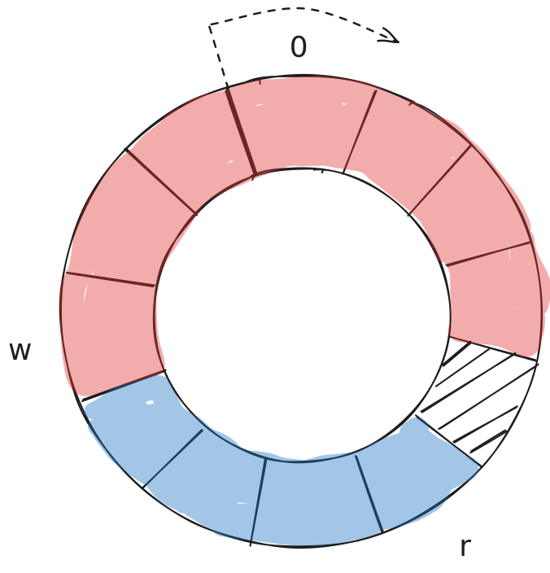
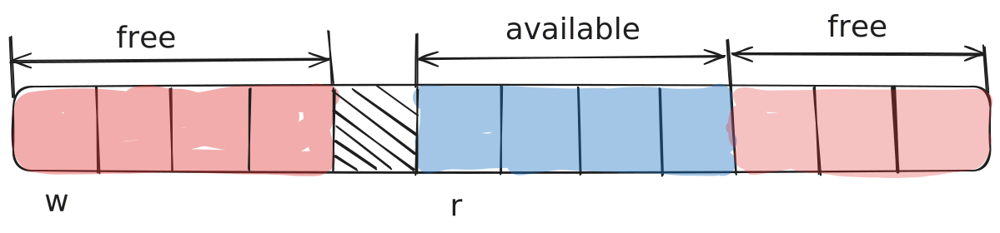
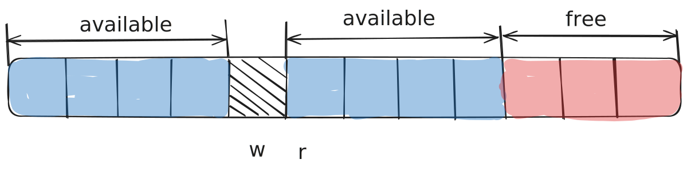
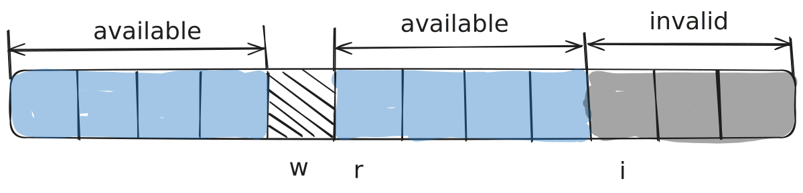
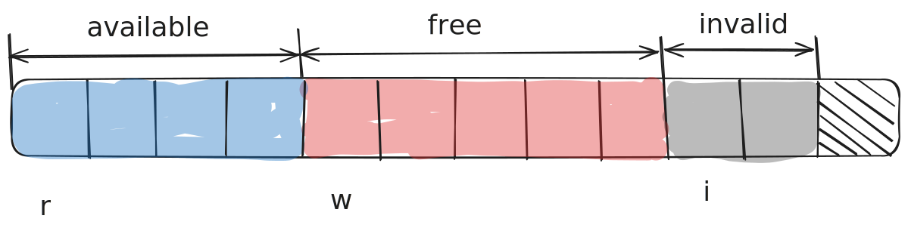
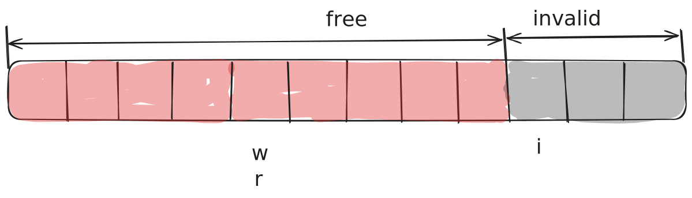
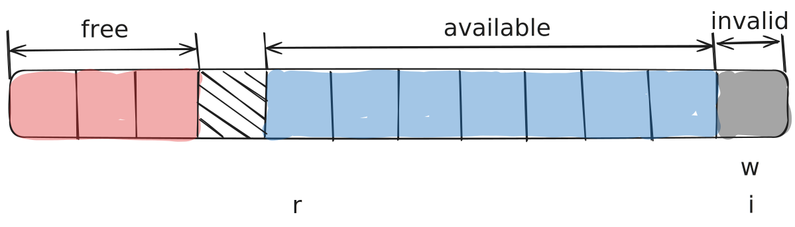

# Bipartite Buffer

## When to use the Bipartite Buffer
A bipartite buffer should be used everywhere the Ring Buffer is used if you want:
* To offload transfers to DMA increasing the transfer speed and freeing up CPU time
* To avoid creating intermediate buffers for APIs that require contiguous data
* To process data inside the buffer without dequeueing it
* When operations on data can fail or only some of the data is used

## How to use
Shown here is an example of typical use:
* Initialization
```cpp
#include "lockfree.hpp"
// --snip--
lockfree::spsc::BipartiteBuf<uint32_t, 1024U> bb_adc;
```

* Consumer thread/interrupt
```cpp
auto read = bb_adc.ReadAcquire();

if (read.first != nullptr) {
    size_t data_used = DoStuffWithData(read);
    bb_adc.ReadRelease(data_used);
}
```

* Producer thread/interrupt
```cpp
if (!write_started) {
    auto *write_ptr = bb_adc.WriteAcquire(data.size());
    if (write_ptr != nullptr) {
        ADC_StartDma(&adc_dma_h, write_ptr, sizeof(data));
        write_started = true;
    }
} else {
    if (ADC_PollDmaComplete(&adc_dma_h) {
        bb_adc.WriteRelease(data.size());
        write_started = false;
    }
}
```

There is also a `std::span` based API for those using C++20 and up:
* Consumer thread/interrupt
```cpp
auto read = bb_adc.ReadAcquireSpan();

if (!read.empty())) {
    auto span_used = DoStuffWithData(read);
    bb_adc.ReadRelease(span_used);
}
```

* Producer thread/interrupt
```cpp
if (!write_started) {
    auto write_span = bb_adc.WriteAcquireSpan(data.size());
    if (!write_span.empty()) {
        ADC_StartDma(&adc_dma_h, write_span.data(), write_span.size_bytes());
        write_started = true;
    }
} else {
    if (ADC_PollDmaComplete(&adc_dma_h) {
        bb_adc.WriteRelease(data.size());
        write_started = false;
    }
}
```

## How it works
The Bipartite Buffer uses the same base principle as the [ring buffer data structure](https://en.wikipedia.org/wiki/Circular_buffer), however its ability to provide contiguous space for writing and reading requires modifying the approach slightly.

Let's consider a typical usage scenario, we want to acquire 4 slots for writing in the following buffer:

<p align="center" width="100%">
    
</p>

We have 7 free slots, so this would work fine for a regular ring buffer.
However when we unroll the buffer we can notice the issue:

<p align="center" width="100%">
    
</p>

We cannot acquire 4 slots from the start of the free space, as there is not enough contiguous space until the end of the buffer, and the only solution is to acquire 4 slots from the beginning.

After acquiring those slots, we have a gap in available data caused by the skip and we must somehow tell the buffer to avoid reading from that region:

<p align="center" width="100%">
    
</p>

This is where we introduce another index - the **invalidate index** ``i``.
We can set it to the start of the region we want to skip, and next time we are reading the data, we only consider data until the invalidate index.

<p align="center" width="100%">
    
</p>

Now the first time we acquire data for reading, we will get the region from `r` to `i`:

<p align="center" width="100%">
    
</p>

And the next time we will acquire the region from `0` to `w`:

<p align="center" width="100%">
    
</p>

Lastly, when writing, we can write over invalidated parts of the buffer as it doesn't contain anything useful, but also have to move the invalidate index:

<p align="center" width="100%">
    
</p>

For more details, [here](https://www.codeproject.com/Articles/3479/The-Bip-Buffer-The-Circular-Buffer-with-a-Twist) is a nice writeup about Bipartite Buffers.

## Dealing with caches on embedded systems
When using the library with DMA or asymmetric multicore on embedded systems with cache it is necessary to perform manual cache synchronization in one of the following ways:
* Using platform specific data synchronization barriers (```DSB``` on ARM)
* By manually invalidating cache
* By setting the MPU/MMU up to not cache the data buffer
